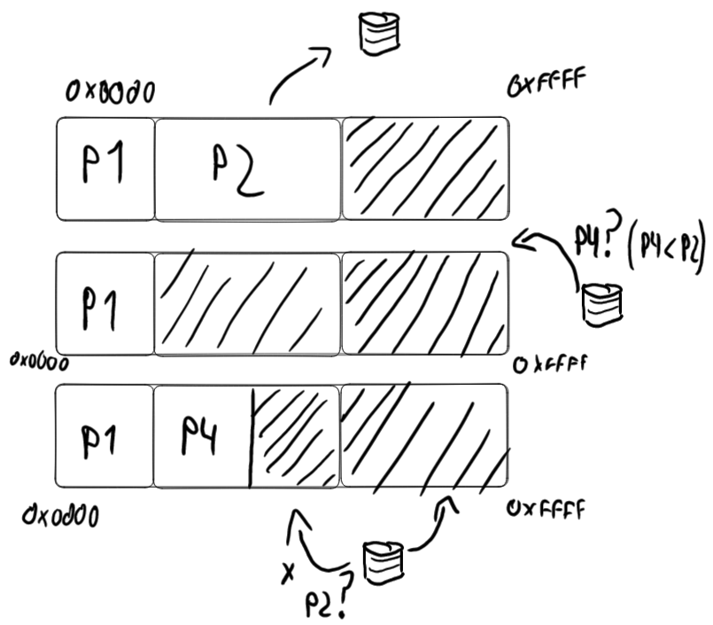

# Administración de Memoria

Vamos a estudiar un subsistema presente en la mayoría de OS: el **manejador de memoria (MMU)**. Se encarga de:

- manejar el espacio libre/ocupado
- asignar y liberar memoria
- controlar swapping
- permisos maybe?

Cuando tenemos un único proceso en memoria todo es mucho más sencillo porque lo tengo en memoria mientras viva el programa. Una vez que introducimos multiprogramación necesitamos hacer algo con la memoria de un proceso que es desalojado. Para eso se usa la técnica de **swapping** que consiste en pasar a disco la memoria de procesos que no se estén ejecutando. Eso es muy lento (hay que copiar toda la memoria **a disco**)... y si tratamos de ser golosos y dejamos ambos procesos en memoria?

De todos modos estamos pateando el problema a futuro. Si en algún momento no me entra nada más definitivamente tengo que mandar algún proceso a disco. Ahora, supongamos lo siguiente:

1. proceso es desalojado
2. nuevo proceso es introducido, ocupando el cacho de memoria recién liberado
3. el proceso antes desalojado tiene que volver a ejecutarse, pero ya pisé el espacio de memoria que tenía asignado. Le asigno el nuevo espacio con direcciones distintas?



En ese caso tenemos algunas alternativas:

- divido y "fijo" bloques de memoria (o sea una vez que te toca un bloque de memoria no te pueden mandar a otro)
  - Esto es malo por muchos motivos, sobre todo porque así solo no resuelve el problema anterior
- cada vez que meto y saco un proceso, reescribo las direcciones de los accesos a memoria
  - mucho muy caro
- la solución que es usada en la práctica es una mezcla entre las primeras 2:
  - para un proceso, las direcciones de memoria son siempre las mismas
  - voy a acomodar las direcciones de los accesos a memoria, pero en lugar de modificar el código alcanza con tener un registro que haga de base.

Por otro lado hay algunos problemas más que no mencionamos:

- cómo sabe el OS qué bloques de memoria están libres?
- cómo sabe dónde conviene ubicar un proceso?
- cómo hago para que un programa no pueda acceder a la memoria de otro?

Estos problemas se los conoce como:

- **Reubicación** (cambio de contexto y swapping)
- **Protección** (memoria privada de los procesos)
- **Manejo del espacio libre** (evitar fragmentación)


## Fragmentación

Ocurre cuando tenemos suficiente memoria para los pedidos de memoria pero en ningún caso es continua. 

### Tipos de fragmentación

Hay 2 tipos de fragmentación:

- **fragmentación externa**: tengo bloques libres pero son chicos y dispersos
- **fragmentación interna**: desperdicio espacio dentro de los propios bloques (p. ej, si sólo asigno bloques de tamaño potencia de 2)

### Solucionando problemas de fragmentación

Si bien se puede usar un proceso de "compactado", dicho proceso es muy costoso como para hacer en un SO RT. En cambio la memoria se divide:

- por segmentos
- por páginas

Ambos casos son bloques de igual tamaño, pero cumplen distintas
funcionalidades. Los segmentos separan memoria **dentro de un proceso** según
su "propósito". En cambio las páginas son las unidades "indivisibles" de
memoria que se le asignan a los procesos.

Una alternativa es dividir todo en bloques y usar un bitmap para trackear qué
bloques están libres y cuáles ocupados. Pero tiene problemas porque no es fácil
encontrar bloques consecutivos y el tamaño del bitmap te determina la
granularidad de los bloques de memoria, lo cual no siempre se llevan bien.

Otra alternativa que si es usada es **usar listas enlazadas**, donde cada nodo es un proceso o bloque libre. En ese caso liberar es barato, asignar es fácil una vez que decidí **dónde**.


### Políticas de asignación

- **First Fit**: asigno el primero que veo que entra.
  - es rápido, pero tiende a fragmentar la memoria.
  - el [allocator de 4.2BSD](./memory_allocator_bsd.md) usa esta dentro del conjunto de políticas
- **Best fit**: me fijo dónde entra con menos desperdicio
  - más lento
  - al contrario de lo esperado, no es tan bueno respecto a fragmentación porque llena la memoria de pequeños cachitos inutilizables
- variante **Quick Fit**: Mantengo una lista de los bloques libres de tamaños más frecuentemente utilizados
  - también usado en el [allocator de 4.2BSD](./memory_allocator_bsd.md)
- **buddy system**
  - usa splitting de bloques
  - restringe que todos los bloques sean de tamaño potencia de 2

## Reubicación

Se parece al problema de "Tengo un programa de tamaño \\( M \\) que no necesita más de \\( K \\) bytes a la vez. Sólo tengo \\(N < M\\) bytes disponibles. Debería poder correr el programa, pero cómo? Combinamos 2 técnicas. El ya mencionado swapping, y virtualización del espacio de memoria. Haciendo uso de la MMU (del hardware, no del SO), traducimos las direcciones virtuales a las correspondientes direcciones físicas.


### Comparación memoria virtual

|  | Sin memoria virtual   | Con Memoria Virtual    |
| --------------- | --------------- | --------------- |
| Espacio de direcciones | tamaño de la memoria física (si la ram es de 4 GB, no puedo direccionar a más que eso)   | tamaño de la memoria física + swap (acá hace la diferencia)   |
| Obtener una celda | Obtengo el contenido y listo   | - Pongo la dirección virtual en el bus de memoria<br> -la MMU traduce la dirección virtual a una física<br> - La tabla de traducción tiene un bit que dice si está cargado en memoria<br> - Si no está cargado se carga<br> - La dirección física se pone en el bus que llega a la placa de memoria<br> - Obtengo el contenido|

## Algunos detalles


- El espacio de memoria virtual está dividido en bloques de tamaño fijo llamados **páginas**
- La memoria física en cambio se divide y agrupa en page frames
- la MMU mappea páginas a frames
- la MMU (hw) interpreta direcciones como página (los n bits más significativos) + offset.
- siempre swappeo páginas

### Detectando y manejando swap

Cuando una página no está en memoria, la MMU emite una page fault que el SO
registró en el array de interrupts. El SO ataja esa fault, y se encarga de
sacar una página de memoria (si hace falta) y otorgarle el espacio a la página
pedida. Es importante también la decisión de **qué página sacar**.

```admonish info title="swapping standard vs actual"
La versión standard de swapping consiste en sacar de memoria **todo** el
proceso, pero eso tiene un costo prohibitivo. Es por eso que hoy en día,
sistemas como Linux y Windows usan una variante que consiste en sacar páginas
de otros procesos pero no los procesos enteros, si no sacamos las páginas
necesarias para liberar suficiente memoria. Es por eso que hoy en día
*swapping* refiere a swapping standard y *paging/paginado* refiere a swapping +
paging/paginado. La operación de **page out** consiste en mover una página de
memoria a disco y **page in** de disco a memoria.
```

```admonish warning title="swapping en dispositivos móviles"

Los sistemas operativos como Android y IOS a diferencia de los que vimos no tienen ni usan ninguna forma de swapping. Esto es porque las memorias secundarias de estos dispositivos tienen restricciones respecto a la cantidad de escrituras que se le pueden hacer. Y swapping incurre en muchas escrituras. Es por eso que ante una situación en donde no tengo dónde ubicar nueva memoria se toman medidas como:

- liberar páginas que sean read only (p. ej. de código)
- las páginas escritas **siempre se mantienen en memoria**
- matar procesos, y sólo guardar el estado en el que se cerraron las aplicaciones

```

### MMU

La MMU se organiza de forma tal que buscar páginas sea rápido pero que la tabla
no ocupe mucho espacio. Si tengo una tabla sola para todo el espacio de memoria
física + swap, voy a necesitar demasiadas entradas en la tabla. Es mucha
memoria (y por ende mucho tiempo). Por eso es mejor usar una **tabla de páginas
multinivel**. 

Como mencionamos antes, usamos los primeros bits (algunos) para ir a la primera
tabla, y después usamos los siguientes bits como offset dentro de esa tabla
(podría tener más niveles). Esto tiene como ventaja que no necesito una tabla
gigante en memoria, si no la tabla de primer nivel y las tablas
correspondientes a las tareas que se estén usando.  (Eso sí, hay un mínimo
extra de espacio que "desperdicio" que se nota a medida que tengo mayor
utilización de la memoria)


```admonish info title="Nota Grande como una casa"
No tenemos una única tabla de páginas para todo, si no que **tenemos una tabla
de páginas multinivel por proceso**. Las arquitecturas suelen incluir un
registro que hay que cargar con la dirección de la tabla de páginas (sorpresa
sorpresa también tiene que ir en la PCB). Tener toda la tabla montada con
registros sería muy rápido pero sólo es viable para tablas muy chicas. 

Como veremos más adelante una optimización que sí se usa es la de mediante hw
implementar una cache para ahorrarnos algunos pasos de la traducción de
direcciones lógicas a físiscas.

Además es común que se use un espacio de direcciones de memoria lógica común
(por ejemplo, 0x8000 a 0x9FFF) y en ese caso si tuviésemos una única tabla de
páginas se nos estarían pisando todas las páginas... todo el trabajo sería al
pedo.
```

### Entrada de la tabla de páginas

En cada entrada de la tabla de páginas hay:

- el page frame
- el bit de ausencia/presencia (en memoria)
- bits de protección
- bit de dirty (para saber si la página fue modificada o no)
- bit de referenciada (para saber si fue leída o no)
- más info según arquitectura

### Cacheando la MMU

- Introdujimos varios accesos a memoria extra por cada acceso a memoria deseado, sobre todo con la tabla multinivel.
- Para reducir el impacto en performance, se suele agregar una cache sobre la tabla de páginas
  - Usa registros rápidos, mejor que acceder a memoria de una
  - me ahorra tablas intermedias
  - busca en paralelo sobre toda la tabla
  - se lo suele llamar TLB

```admonish info title="ASIDs"
Algunas TLBs guardan **address-space identifiers**, que identifican cada
proceso y brindan protección por proceso. (dado que si no, como la TLB es parte
del HW no tiene noción de procesos y esas y uno podría estar accediendo desde
otro proceso a las páginas de mi proceso)
```

### Reemplazo de páginas

Podemos hacer uso de los campos que nos provee la tabla de páginas:

- FIFO así como viene 
- FIFO pero si tiene referenced paso a la siguiente asumiendo que recién la
  subieron. Si no hay más ahí si uso esa.
- Not Recently Used: extendiendo la idea anterior, primero busco que no sean
  referenciadas ni modificadas. Luego las que fueron referenciadas pero no
  modificadas, por último las modificadas.
- Least Recently Used (LRU): mantengo timestamp (obviamente no es gratis) en cada entrada de la tabla de páginas.
- otra cosa a considerar: desalojo las páginas de mi proceso o de otro?

### Consideraciones Extra

- las estrategias mencionadas a veces se combinan con cargar páginas por adelantado
  - me evito algunos page fault
  - aprovecho la localidad referencial
- puedo usar páginas especiales:
  - read only
  - no swappeables

### Pasos durante un Page Fault

1. se emite el page fault (una interrupción), que atrapa el kernel.
2. se guardan el IP y otros registros en el stack.
3. El kernel determina que es un page fault y llama a la rutina específica
4. Averigua qué dirección virtual se estaba buscando (por lo general queda algún registro de eso)
5. se chequea que sea una dirección válida y que el proceso tenga los permisos suficientes. Si no los tiene se mata al proceso con una señal de segment violation (SIGSEGV)
6. Se busca un page frame libre si lo hubiese y si no se libera mediante el algoritmo de reemplazo de páginas
7. Si la página tenía el bit dirty prendido hay que bajarla a disco
  - el proceso del kernel de I/O es suspendido, hay un context switch y la página se marca como busy para que no se use.
8. Cuando el SI es notificado de que terminó de bajar la página a disco inicia la operación para cargar en memoria la página a la que le liberamos el espacio.
9. Cuando llega la interrupción que indica que el I/O para cargar la página terminó, se actualiza la tabla de páginas para indicar que está cargada.
10. La instrucción que causó el page fault se recomienza, tomando el IP del stack y los valores de los registros.
11. Se devuelve el control al proceso de usuario.


### Thrashing

Se le llama **Thrashing** a la situación en la que no hay suficiente memoria y además hay muchos procesos compitiendo por usarla. Eso puede generar que el SO esté constantemente cambiando páginas de memoria a disco una y otra vez.

## Protección y Reubicación

Ya mencionamos que cada proceso tendría su propia tabla de páginas. Eso ya es
un atenuante y cumple además funciones de protección. Otra solución posible es
que cada proceso tenga su propio espacio de memoria. Esos espacios llamados
**segmentos** se determinan en base a un registro especial que describe a qué
segmento hacen referencia las direcciones. Sin embargo, esto requiere soporte
especial del hardware (para implementarse eficientemente) e incluso hoy en día
no es muy tenido en cuenta en los OS.

### Segmentación en Intel

- Cada proceso tiene su Local Descriptor Table (LDT).
- Los programas suelen tener un segmento para código, otro para datos y otro
  para el stack.
- Hay una Global Descriptor Table (GDT) compartida. Ahí están los segmentos del
  sistema.
- Tenemos 2 registros de 16 bits, DS y CS que sirven para indicar qué segmento
  se va a usar.
  - 13 bits son un índice, 1 indica si es global o no y 2 sirven para
    protección
  - Cuando se carga algo en uno de esos registros se trae la entrada de la
    LDT/GDT que corresponde, además el OS recibe una interrupción y puede
    hacer validaciones de seguridad.
- Cada entrada de la LDT y GDT tiene la base de las direcciones de memoria y el
  tamaño del segmento
  - las direcciones se interpretan como física/virtual según esté habilitado el
    paginado

## Copy-on-write

Cuando usamos la syscall `fork()`, es común utilizar la estrategia **copy-on-write**, que consiste en:

- Al crear el proceso se usan las mismas páginas
- Cuando el proceso padre o el hijo escriben en alguna página, ahí se duplican
  y cada uno tiene su copia independiente
- Esto tiene mucho sentido porque si vamos a llamar a `exec()` o alguna otra
  syscall que pisa la memoria del proceso, pierde sentido copiarnos toda la
  memoria y tabla de páginas del proceso padre.

## Miscelaneos

### Hashed Page Tables

Una alternativa a las tablas de páginas tradicionales es usar tablas de hash
con chaining. Cada "row" de la tabla tiene una lista enlazada (para las
colisiones) en donde los nodos tienen la dirección de la página, el frame que
le corresponde y un puntero al siguiente elemento. Hay una variante propuesta
para espacios de memoria de 64 bits que consiste en usar **clustered page
tables** que tienen un concepto similar pero cada entrada de la tabla puede
representar a muchas páginas en lugar de una sola. Entonces una única entrada
puede guardar los mappeos de muchos frames. Es útil cuando hay direcciones de
memoria esparsas (muchas referencias no contiguas y desparramadas a lo largo de
la memoria).

### Inverted Page Tables

El proceso de las tablas de páginas es más o menos como sigue:

- Cada proceso tiene su tabla de páginas
- Cada entrada de la tabla representa una página en el espacio de direcciones
  virtual (independientemente de si está en uso o no).
- el SO traduce direcciones lógicas en frames (aka direcciones físicas)
  - como la tabla **está ordenada según las direcciones lógicas**, es "fácil"
    buscar la entrada en la tabla correspondiente.

Una de las desventajas de este proceso es que las tablas de páginas pueden
tener muchas entradas, millones incluso. Y eso incurre en un consumo más alto
de memoria.

Para resolver ese problema, se puede usar una **inverted page table**. La idea
es que tenemos una única tabla, y la tabla tiene una entrada por cada frame de
la memoria. La entrada consiste de información del proceso al que se le asignó
el frame (PID por ejemplo), junto con la dirección virtual que le fue asignada.

- tengo **una única tabla**.
- la tabla tiene una única entrada por cada frame, no hay repetidos.


Pero ojo, ahora las direcciones están ordenadas por su dirección física, no
lógica. Entonces tendría que hacer un barrido secuencial para resolver la
traducción de la dirección lógica. Eso es muy caro, y el motivo por el que se
suele combinar con hashing para reducir el número de comparaciones.

Otro problema que tiene esta técnica es que no puede haber memoria compartida,
ya que hay una única entrada en la tabla por dirección física.
