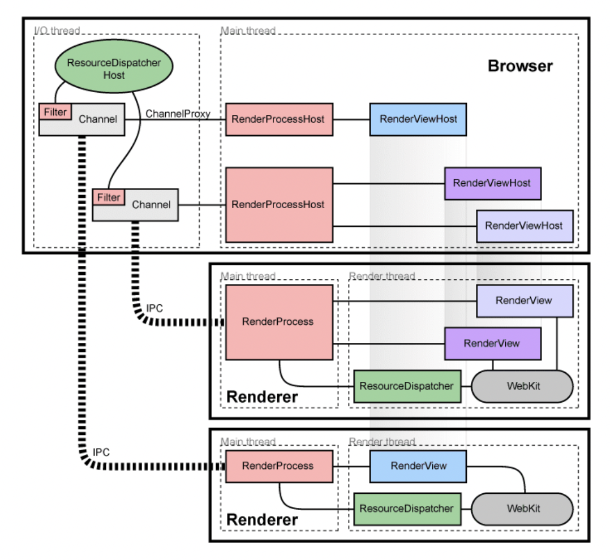
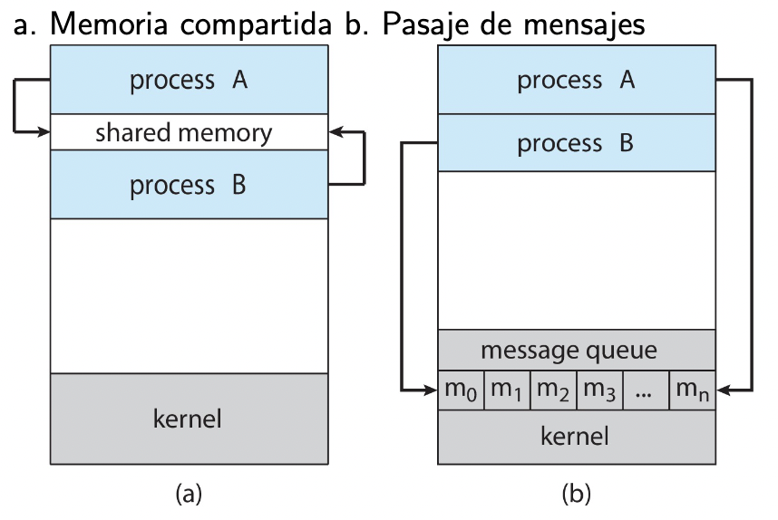

# Intercomunicación Entre Procesos (IPC)

La comunicación entre procesos es parte fundamental de muchas piezas de software de hoy en día, ya sea entre procesos de un mismo equipo o entre procesos remotos. Se usa en contextos donde se busca/tiene:

- Mejorar la velocidad de procesamiento
- Modularizar funcionalidad (hoy en día el software es grande y complejo)

```admonish info title="Arquitectura multiproceso en Chrome"
Originalmente (e incluso hoy en día), los browsers tenían un único proceso. Esto trae algunos problemas, por ejemplo que si un sitio se "cuelga", se te cuelga todo el browser.

Chrome en cambio crea **3 tipos de procesos**:

- Browser: administra UI, acceso a disco y a red.
- Renderer: muestra las páginas, se encarga de procesar html y javascript. Se instancia un nuevo proceso Renderer por sitio.
- Plug-in: Proceso para cada tipo de plugin.



Más info en la [documentación de chromium](https://www.chromium.org/developers/design-documents/multi-process-architecture/)
```

## Tipos de IPC

Hay distintas formas de realizar IPC:

- memoria compartida
- algún recurso compartido (ej: archivos)
- pasaje de mensajes (nos vamos a concentrar en este más que nada)



Los SO brindan distintas apis para hacer IPC. Por ejemplo:

- Unix SySV Transport Layer Interface
- BSD Sockets (En linux fue el que terminó ganando)
  - idea: 
    1. Dame un agujero en la pared
    2. Uní mi socket con el de este proceso
    3. tengo `open()`, `read()`, `write()` (similar a un archivo)

A los ojos de un proceso, hacer IPC es como hacer E/S. Los detalles los esconde todos el SO.

## Pipes

Son un "pseudo archivo" que por debajo es una forma de IPC. Tenemos:

- Ordinary pipes (como los que usamos en la terminal): `ls -l | grep so`
- Named pipes: `mkfifo -m 0640 /tmp/mituberia`

## IPC Sincrónico/Asincrónico

- Síncrona (ej TCP):
  - El emisor no termina de enviar hasta que el receptor no recibe.
  - Si el mensaje se envió sin error suele significar que también se recibió sin error.
  - En general es bloqueante.
- Asíncrona (ej UDP):
  - El emisor envía y "en algún momento le llegará".
  - suele requerir algún mecanismo adicional para saber si llegó el mensaje
  - no bloquea al emisor (salvo capaz para copiar el mensaje a un buffer del SO o desde un buffer)
