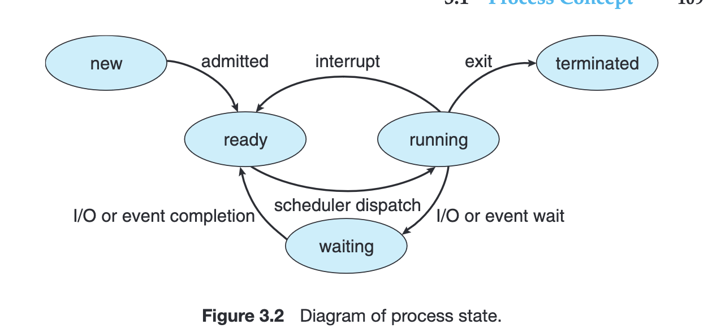
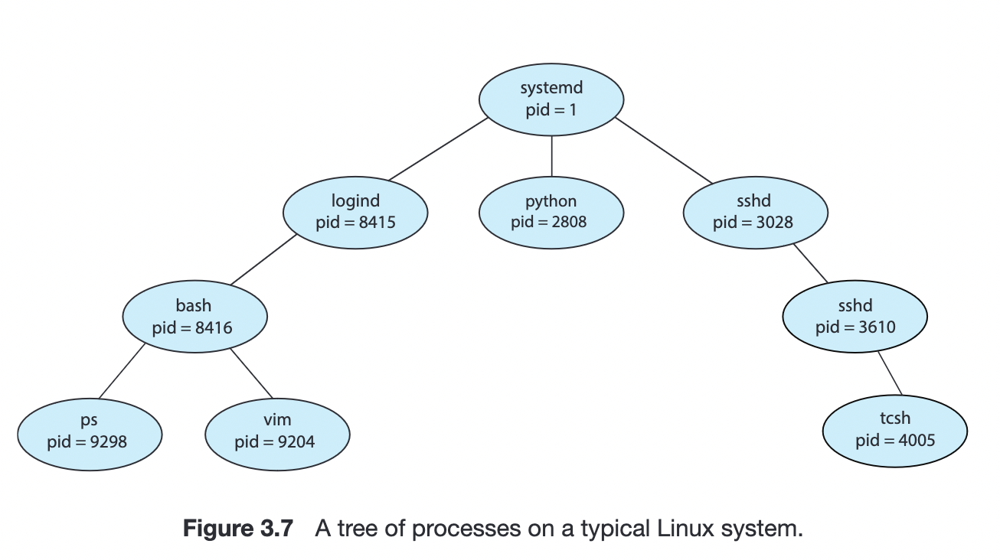
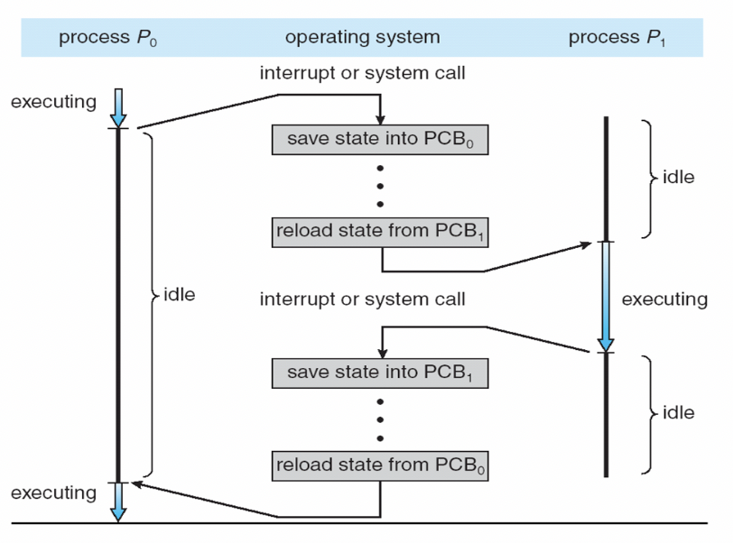

# Procesos

Un programa podemos definirlo como un texto escrito en un lenguaje de programación, o bien dicho código compilado a lenguaje máquina. Es **estático**. Ahora, cuando ese programa se ejecuta, pasamos a tener un **proceso**. Un proceso es la contracara dinámica del programa. 

El estado de un proceso está representado por:

- los registros
- la memoria del proceso
  - stack
  - heap (o data section). En realidad el silverschatz lo separa en
    - data section: variables globales
    - heap: memoria dinámica
  - el área de text: donde se almacena el código

Justamente los procesos son dinámicos ya que cambian su estado a medida que el programa ejecuta. Podemos entonces armar un diagrama de estados de un proceso:



- **new**: el proceso se está creando
- **running**: se están ejecutando instrucciones
- **waiting**: el proceso está esperando por un evento (I/O o recepción de alguna señal)
- **ready**: el proceso está en espera de ser asignado a un procesador
- **terminated**: el proceso terminó la ejecución

## Modelo de procesos

El modelo de procesos que consideramos es un modelo de **procesos
secuenciales**. Esto quiere decir que cada proceso piensa que tiene un
único CPU propio. Sin embargo, en la realidad no es así. Como
mencionamos anteriormente, la técnica de **multiprogramación** surgió
como técnica para aprovechar el tiempo ocioso de ejecución de otros
programas (ej: tienen que esperar I/O). Esto, junto a las ideas de
**timesharing** (repartir el tiempo de procesador) caracterizan a este
modelo, en donde si bien cada proceso cree que está asignado a un CPU
de manera exclusiva, en realidad el sistema operativo es el encargado
de asignara y retirar del cpu a los distintos procesos.


Ahora, si un proceso tiene un estado, pero no está constantemente en ejecución y tampoco es necesario que ejecute sobre el mismo CPU, necesitamos guardar en algún lado si estado. Cada proceso se representa en el sistema operativo con un **PCB** (process control block). Una PCB contiene:

- El estado actual del proceso
- El PC
- Registros del CPU (incluye flags del procesador): junto con el PC, es necesario guardar explícitamente la data cuando ocurren interrupciones.
- info para el scheduler, por ejemplo la prioridad del proceso
- info de manejo de memoria
- accounting info: estadísticas de tiempo de cómputo
- status de IO: tiene la lista de dispositivos de I/O asignados al proceso, los archivos abiertos, etc.


## Threads

Una limitación de este modelo de cómputo es que asume que todo programa tiene un único flujo de ejecución. Sin embargo, la mayoría de programas realizxan varias tareas a la vez. Es por esto que se extiende este concepto de proceso para permitir que un proceso tenga varios **threads de ejecución**. En architecturas multicore cobra más importancia todavía porque en un core pueden correr varios threads en paralelo. En los sistemas que cuentan con PCB y threads, la PCB se extiende para que tenga información sobre cada thread. No solo eso, si no que en la práctica crear threads es menos costoso que crear nuevos procesos.

## Árbol de Procesos

- Los procesos están organizados jerárquicamente, como un árbol.
- Cuando el SO comienza, lanza un proceso que se suele llamar init o systemd
- Cada proceso puede lanzar procesos hijos:
  - `fork()` es una llamada al sistema que crea un proceso igual al actual
  - el resultado es el PID del proceso hijo
  - el padre puede suspender la ejecución hasta que un proceso (p ej. el proceso hijo) termine conociendo su PID con la syscall `wait()`
  - cuando el proceso hijo termina, el código de estado indicado por el hijo se le devuelve al padre.
  - el proceso hijo puede, o bien seguir ejecutando lo mismo que el proceso padre, o bien ejecutar algo distinto. Para eso puede usar la syscall `exec()` para reemplazar su código binario por otro.



Por ejemplo, cuando lanzamos un programa desde la shell, el proceso de la shell hace un llamado a `fork()` y el proceso hijo hace `exec()` del programa que se desea ejecutar. El proceso de la shell espera hasta que el proceso hijo termine.

```admonish warning title="Cuidado"
Esto es una simplificación de lo que en realidad ocurre en una shell hoy en día
```

```admonish info title="pstree"
pstree es un comando que muestra los procesos actuales en forma de árbol. Si recibe un PID como parámetro, muestra el árbol a partir de ese proceso. Para más info `man pstree`
```

## Actividades de un proceso

Vimos los distintos estados que puede tener un proceso en ejecución. Cuando un proceso está en ejecución, puede:

- hacer operaciones entre registros y direcciones de memoria
- llamadas al sistema operativo o *syscalls* (las vemos más adelante)
- I/O (por lo general mediante llamadas al sistema operativo) (las vemos más adelante)

Como mencionamos antes, un proceso no está todo el tiempo en ejecución (Uno si no podría esperar a que termine, pero y si el proceso se "cuelga"?). La pregunta es entonces por cuánto tiempo ejecuta? Ese tiempo lo llamamos **quantum**. En general hay 2 formas de administrar ese tiempo:

- **cooperation**: los procesos son los que "voluntariamente" detienen su ejecución para dar tiempo a otros procesos.
- **preemption**: los procesos tienen un tiempo limitado para ejecutar, y cuando este acaba el sistema operativo pasa el proceso al estado *waiting* y asigna el CPU a otro proceso. Lo importante de esto es que el proceso en ningún momento puede decidir si se puede quedar o no con un poco más de tiempo de CPU.
  - este es el estándar de hoy día, y para implementarlo el SO se cuelga de la interrupción del reloj.

Pero en este segundo caso surgen las preguntas:

- cómo decide el OS a quién le toca y cuánto tiempo tiene?
- qué significa hacer que otro proceso se ejecute?

## El Scheduler

Para responder las preguntas anteriores aparece el **scheduler**, un módulo del sistema operativo cuya función es decidir a qué proceso le corresponde ejecutar en cada momento.

Cuando el scheduler tiene que cambiar el programa que se ejecura en la CPU, primero tiene que:

1. guardar los registros
2. guardar el IP
3. si es un programa nuevo, cargarlo en memoria
4. cargar los registros correspondientes
5. poner el nuevo IP
6. algunas cosas extra que se explican más adelante

```admonish info text="PCB y PCT"
Para los pasos 1 y 2 usamos la PCB mencionada anteriormente, pero además tenemos una estructura más que es la PCT (Process Control Table), que en resumidas cuerntas es un diccionario / array de PCBs.
```

Esta serie de pasos se la conoce como *cambio de contexto* o **context switch** y no es gratis, por lo que el scheduler tiene que optimizar el tiempo que está haciendo *context switch*.



## Actividades de un proceso - syscalls

- Un proceso también puede hacer llamadas al sistema (`fork()`, `exec()`, etc.)
- Desde el punto de vista del código, es un llamado a función (linkeada dinámicamente). Muchas veces incluso ni vemos la syscall propia, si no que los lenguajes nos abstraen de dichas actividades.
  - esto de todos modos es más costoso que ejecutar código, ya que requiere de una interrupción, y a veces cambios de contexto.
  - Por ejemplo, cuando uno en C++ hace `cout << "Hola Mundo\n";` por detrás está realizando llamadas al sistema para escribir por salida estándar.
- En todos los casos se tiene que llamar a kernel (en linux se hace mediante una interrupción al handler `0x80`, ahora directamente `syscall`), y en varios casos es necesario cambiar el nivel de privilegio, contexto, interrupciones, etc.

Ejemplo usando syscall write (en x86-64):

```x86asm
global start

section .text
start:
  mov rax, 1      ; write
  mov rdi, 1      ; stdout
  mov rsi, msg
  mov rdx, 13
  syscall

  mov rax, 0x60   ; exit
  mov rdi, 0
  syscall

section .data

msg:    db   "Hello, world!"
```

El mismo ejemplo en C:

```c
#include <unistd.h>

int main(int argc, char* argv[]) {
    write(1, "Hello, world!\n", 14);
    return 0;
}
```

## API del SO

Las syscalls proveen una interfaz a los servicios del OS, también conocido como API del OS.

```admonish info text="Syscalls"
se pueden ver las llamadas al sistema operativo disponibles usando el comando `man syscalls`
```

Existe hoy en día un estándar para la API de los OS basados en unix, llamado **POSIX** (**P**ortable **O**perating **S**ystem **I**nfertace; **X**: UNIX). Define algunos servicios core que debe brindar el OS:
- Creación y manejo de procesos
- Pipes (lo vemos más adelante)
- Señales
- Operaciones de archivos y directorios
- Excepciones
- Errores del bus.
- Biblioteca C
- Instrucciones de E/S y de control de dispositivo (ioctl).

## I/O

Por último, mencionamos que dentro de las cosas que un proceso puede hacer, una es operaciones de I/O (Entrada y Salida).

Si hay algo que caracterizan las entradas de I/O es que **son muy lentas**. Entonces, cuando un proceso necesita hacer I/O tiene algunas opciones:

- quedarse esperando (**busy waiting**) 
- **polling** (que el proceso consulte cada tanto si la operación se completó o no) (es como una forma de busy waiting, pero tranquilamente el proceso puede hacer algo más mientras consulta a ver si terminó la I/O)
- **interrupciones**: cuando pedís I/O te saco y te vuelvo recién a meter cuando se completó la operación
- Otras que no vemos

```admonish info text="Multiprogramación desde el código"
Además, podemos caracterizar en 2 el tipo de operaciones (aplica a I/O) pero puede ser en general:

- **bloqueante**: hago el "inicio de la operación" (ya sea con una syscall o no) y el proceso no recibe de vuelta el control/ se bloquea hasta que la operación termina
- **no bloqueante**: hago la syscall, y retorna de inmediato. Sin embargo, no significa que la operación terminó. Si no que tengo que enterarme de alguna manera que la operación terminó.

En otros contextos también se usa la idea de bloqueante vs no bloqueante para esa idea de me bloqueo hasta que termina una operación vs. consulto yo a ver cuándo termina y mientras tanto hago algo más.
```

Si recordamos, en la PCB se guardaba el estado de un proceso. Pero además de eso también se guarda información relevante para el scheduler como la prioridad del proceso y la lista de recursos por los que está esperando.

## Señales

Es un mecanismo presente en los sistemas POSIX que permiten notificar a un proceso la ocurrencia de un evento. Un proceso tiene al igual que el SO, handlers para las distintas señales. Cuando recibe una, la ejecución del proceso se detiene y se ejecuta el handler correspondiente.
Algunas señales conocidas son `SIGINT`, `SIGKILL`, `SIGSEGV`, `SIGSTOP`, entre otras.
