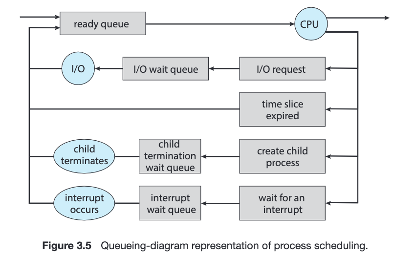
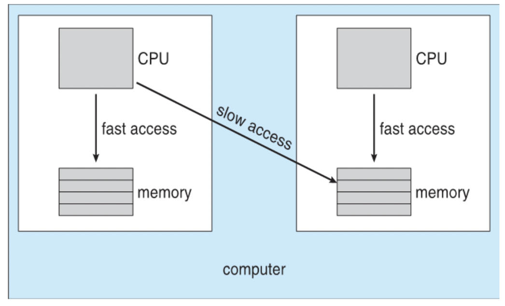
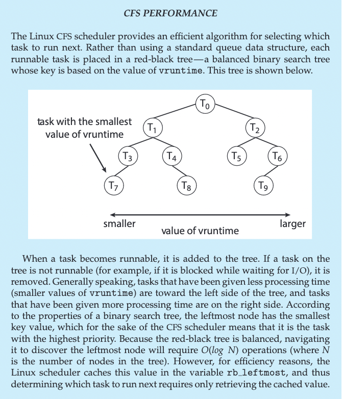

# Scheduling

La política de scheduling es una parte fundamental y distintiva del SO. Una mejor política de scheduling impacta fuertemente en el rendimiento y funcionamiento de un SO, es por eso que gran parte de los esfuerzos en optimizar un SO pasa por mejorar la política de scheduling. Sin embargo, para hablar de optimización tenemos que saber qué optimizar y qué métricas usamos.

- Ecuanimidad (**fairness**): que los recursos del procesador se repartan equitativamente.
- Eficiencia: tengo que maximizar el tiempo que la CPU está ocupada ejecutando "cosas útiles". Por ejemplo, no está bueno dar un quantum chico porque gasto mucho tiempo en context switches.
- Carga del sistema: minimiza la cantidad de procesos listos a la espera de ser ejecutados. O sea tener muchos procesos listos y no ejecutando = malo.
- Tiempo de respuesta: minimizar el tiempo de respuesta **percibido por los usuarios interactivos**.
- Latencia: minimizar el tiempo requerido para un proceso para que empiece a mostrar resultados.
- Rendimiento / Throughput: maximizo #procesos terminados por unidad de tiempo.
- Liberación de recursos: hacer que terminen cuanto antes los procesos que consumen muchos recursos.

Obviamente no puede tener todo, y cada SO hace un balance y prioriza de maneras distintas.

Para el resto de la info, vamos a asumir que tenemos un único procesador. Pero esto se generaliza a más procesadores en donde el scheduler ahora también tiene que decidir a qué procesador mandar cada proceso. Eso agrega nuevas consideraciones como por ejemplo el costo de mover un proceso de un procesador a otro (por cuestiones de localidad de memoria por ejemplo).

## El procesador como una sala de espera

- La analogía y modelo que se usa es el de colas. El scheduler mantiene una **ready queue** con los procesos listos que tiene para mantener. En general por debajo la ready queue es una lista enlazada en donde cada nodo apunta a la PCB correspondiente.
- Entonces distintos tipos de colas van a cambiar el funcionamiento del scheduler.
  - Un primer enfoque es el de una simple cola FIFO, pero trae el problema de que estaríamos tratando a todos los procesos de la misma manera. No es lo mismo un proceso que requiera mucha CPU (*cpu-bound*) a uno que no (por ejemplo un proceso I/O-bound).
  - Para eso podemos resolverlo agregando prioridades al modelo.
  - Siguiente problema: **inanición** (starvation). Los procesos de mayor prioridad están constantemente "ganando" tiempo de CPU y traba a los de menor prioridad
  - Posible solución: a medida que un proceso "envejece", le aumento la priordad.
- Otro enfoque: round robin, o sea darle un cachito de tiempo a cada proceso.
  - cuánto quantum les doy?
    - Si es muy largo, los procesos "interactivos" dejarían de verse como tales.
    - Si es muy corto, tengo mucho context switch
- Qué hago? Combino ambos enfoques: round robin + prioridades.
  - además se le suele dar un poquito más de prioridad a los procesos IO bound dado que no requieren tanto tiempo de CPU y liberan rápidamente su lugae.

```admonish info text="Otras Colas"
Además de la ready queue, el OS tiene otras colas. Recordemos que podemos tener operaciones de I/O, o procesos a la espera de algún evento (ej: esperar a que un proceso hijo termine). En dichos casos, los procesos tienen que esperar a que esa operación termine (por lo general es mucho más lenta que el resto de las operaciones en CPU), entonces el scheduler puede mover el proceso a una **wait queue**


```

## Múltiples colas

Esto extiende el modelo anterior. Cada cola representa el quantum que se le otorga a los procesos de dicha cola. Y las de menos quantum tienen mayor prioridad. Además, el scheduler puede decidir mover al proceso de cola.

## Scheduling en sistemas batch

- Se suele usar la estrategia Shortest Job First. 
  - Apunta a maximizar el throughput. 
  - En general en estos sistemas se puede predecir el tiempo que tarda el trabajo
    - Cuando conocés las duraciones de antemano, esta estrategia es óptima respecto a la latencia promedio.
  - alternativa: pensar cuánto tiempo falta hasta hacer E/S nuevamente
  - cómo predicen el tiempo en CPU? Uso info del pasado (estadísticas).

## Scheduling en real time

Cuando hablamos de sistemas real time nos referimos a la predictibilidad del mismo. Esto quiere decir que las tareas/procesos tienen **deadlines estrictos**, por lo general presente en sistemas críticos. O sea no cumplo deadline = MALO. No vimos mucho de esto pero mencionamos 2 alternativas:

- scheduling cooperativo
- Earliest Deadline First

## Scheduling en SMP

Ahora si en este contexto tenemos un sistema multiprocesador. El problema principal del scheduling en estos sistemas es la caché. Como dijimos antes, mover un proceso a otro procesador puede implicar perder la data que ya teníamos en cache. Se introduce en estos casos el concepto de afinidad al procesador para incentivar a que se use el mismo procesador.

- Decimos que la **afinidad es dura** si se tiene que respetar a rajatabla (siempre al mismo procesador).
- Si no es **afinidad blanda**


```admonish info title="NUMA (Non Uniform Memory Access)"
Nuevas arquitecturas permiten al CPU acceder a los espacios de memoria de otros CPUs. Sin embargo, esto tiene un costo extra por lo que sigue siendo mejor el acceso a la memoria local del CPU. También sigue existiendo el problema de la cache, con lo cual es una mejora pero no es una solución, si no una herramienta extra.


```

```admonish info title="El scheduler en linux"
En lugar de usar una cola, se tiene un ABB donde la clave es el tiempo en ejecución para la "ready queue". Luego, en log #Procesos se puede obtener el siguiente a ejecutar.

```
