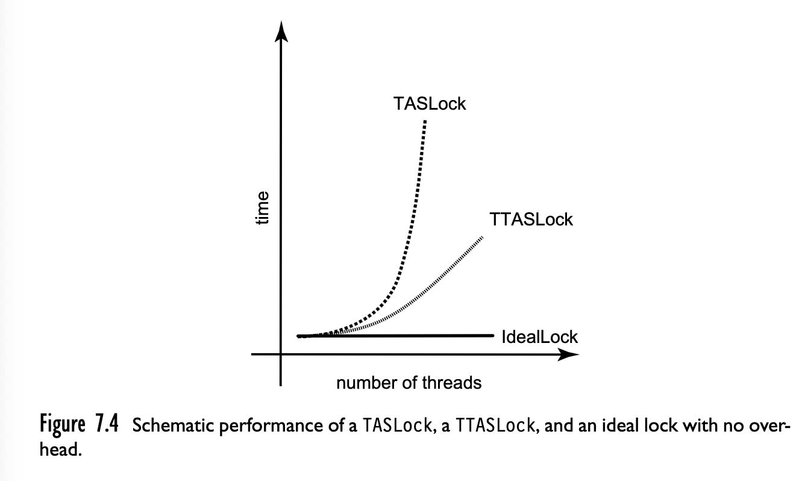

# Sincronización entre procesos

Intro bla bla... [PAPER Shan Lu et al. Learning from Mistakes - A Comprehensive Study on Real World Concurrency Bug Characteristics. ASPLOS'08](http://www.cs.columbia.edu/~junfeng/10fa-e6998/papers/concurrency-bugs.pdf)

## Sección Crítica (CRIT)

Es un cacho de código tal que:

- sólo hay (o debería haber) un proceso a la vez en CRIT.
- todo proceso que esté esperando entrar a CRIT va a entrar eventualmente.
- Ningún proceso fuera de CRIT puede bloquear a otro.

A nivel código se implementa con dos llamados: uno para entrar y otro para salir de la CRIT. Si implementamos exitosamente secciones críticas, los procesos pueden compartir datos sin tosquearse.

## Implementando secciones críticas

Una alternativa es usar **locks**. Son como booleanos compartidos. Cuando entro a la CRIT lo pongo en 1, al salir en 0. Si está en 1 espero a que tenga un 0.

```admonish warning text="no todo es tan simple"
El problema de que el scheduler nos cague puede seguir ocurriendo (primero checkeo el bool, después me suspenden el proceso). Por lo general nos remitimos a soluciones que usan el HW.
```

## TAS 

El Hw suele proveer alguna instrucción que permite settear atómicamente el valor de un booleano/entero en 1. Nosotros la vamos a llamar `TestAndSet`.

```
fn TestAndSet(variable) {
  old_value = variable.value
  variable.value = 1
  return old_value
}
```

Pero además toda la operación se realiza de forma atómica, o sea de forma indivisible sin importar que tengamos varias CPUs.

```admonish info title="TestAndSet en x86"
En x86 tenés la operación `bts` que te permite settear el flag de carry y un bit de un registro. Y esa operación si se le agrega el prefijo `lock` hace que se ejecute de manera atómica. O sea `lock bts <registro> <nro_de_bit>`
```

## Usando TAS

```
boolean lock;

while(TRUE) {
  while (TestAndSet(&lock)) {
    // devuelve true si estaba lockeado. No hago nada
  }

  // devolvió FALSE, estoy en la sección crítica (recordar que después del check pasa a ser TRUE el valor del lock);
  // hago lo que necesite la sección crítica

  // salgo de la sección crítica
  lock = FALSE;

  // acá puedo hacer todo lo que no tenga sección crítica
}
```

```admonish info title="Observación"
Durante el while interno no hace nada, pero está comiendo \<\<MUCHO\>\> CPU (busy wait)
```

## Alternativa: Sleep

Una alternativa podría ser agregar un sleep adentro del while. Y cuando falla el intento de obtener el lock suspender el proceso durante un tiempo. La cuestión es cuánto tiempo? 

- Si es mucho, pierdo tiempo (y alguien puede "robarme el lugar").
- Si es poco, sigo desperdiciando CPU (menos que antes though).
- Y si le pido al SO que me deje seguir cuando esté liberado el lock?

## Problemas con sleep: Problema del Productor-Consumidor

- Un proceso mete elementos a un buffer (Productor), otro los retira (Consumidor).
- Nuevamente hay **contención** de recursos. Pero además hay un problema adicional, qué pasa si 
  - se llenó el buffer y el productor quiere meter cosas
  - se vació el buffer y el consumidor quiere sacar cosas
  - En ambos casos la respuesta es esperar

Seguro que busy waiting nos alcanza, y si usamos *sleep/wakeup*?

De vuelta estamos atados a la traza de ejecución. Como el chequeo de
la capacidad del buffer y el sleep/wakeup no es atómico de por sí,
puede pasar que el consumidor reciba el wakeup antes de usar el
sleep, y después haga el sleep. Si por ejemplo el buffer es de un
único elemento, puede pasar que se cuelgue el sistema.

## Semáforos: la true way

Un semáforo es una variable entera con las siguientes características:

- se puede inicializar con cualquier valor
- tiene 2 operaciones:
  - `wait()`
  - `signal()`
- `wait(s): while (s <= 0) sleep(); s--;`
- `signal(s): s++; if (X espera por s) wakeup(X)`
- Ambas se implementan de forma tal que su ejecución sea atómica (sin interrupciones en realidad)
- Caso particular: `mutex = lock = semáforo inicializado en 1`
    
```admonish info title="Productor-Consumidor con semáforos"
Una posible implementación del mismo problema anterior pero usando semáforos:

    semaforo mutex = 1;
    semaforo llenos = 0;
    semaforo vacios = N; // Capacidad del buffer

    fn productor() {
      while(true) {
        item = producir_item();

        // Entrando a zona crítica
        wait(vacios);
        wait(mutex);

        agregar(item, buffer);
        cant++;

        signal(mutex);
        signal(llenos);
      }    
    }

    fn consumidor() {
        while(true) {
          wait(llenos); // espero a que "me despierten"

          wait(mutex); // acceso exclusivo al buffer
          item = sacar(buffer);
          cant--;

          signal(mutex); // libero el buffer
          signal(vacios); // incremento la "capacidad del bufer" trackeada por el semáforo. si estaba lleno (vacios = -1) ahora pasa a 0 y despierta al productor
          hacer_algo(item); // zona no crítica
        }
      }
```
```admonish warning title="Cuidado"
Esto está muy lindo, pero **ojo**. Tan sólo invertir el orden de los `wait`/`signal` puede resultar en una situación en la que ambos se quedan esperando. Por ejemplo, si consumidor se implementara de la siguiente manera:

    fn consumidor() {
      wait(mutex);
      wait(llenos);

      // ... El resto igual
    }  

Imaginemos que :

- el consumidor ejecuta primero y le toca hacer `wait(mutex)` (adquiere el mutex)
- luego hace `wait(llenos);` y se queda esperando porque por ahora está en 0
- luego ejecuta el productor, y hace `wait(vacios)` exitosamente pero al hacer `wait(mutex)` se va a quedar esperando porque el mutex ya estaba bloqueado por el consumidor.

Esta situación en la que se da una dependencia de recursos cíclica entre procesos se llama **deadlock**, y es uno de los grandes problemas que surgen en la concurrencia manifestándose en todo tipo de sistemas.
```

## Volviendo al siglo 21...

Hoy en día la mayoría de lenguajes de alto nivel proveen interfaces para implementar secciones críticas y manejo de concurrencia. Por ejemplo con:

- bool atómicos
- int atómico
- colas atómica


## Spin locks

Basándonos en el diseño que vimos de bools atómicos vamos a construir una serie de locks. El primero de ellos es el mutex llamado TASLock, o spin lock.

```
atomic<bool> reg;

fn create() { reg.set(false); }
fn lock() { while(reg.testAndSet()) {} }
fn unlock() { reg.set(false); }
```

```admonish warning title="Cuidado"
`lock()` **no es atómico**
```

Ejemplo de uso:

```
TasLock mutex;

int donar(int donacion) {
    int res;

    // inicia sección crítica
    mutex.lock();
    fondo += donacion;
    mutex.unlock();
    // Fin sección crítica

    // inicio de otra sección crítica
    mutex.lock();
    res = ticket; ticket++;
    mutex.unlock();
    // Fin de la sección crítica

    return res;
}
```

Algunas observaciones sobre el TASLock:

- todo `lock()` necesita su `unlock()`, no hay que olvidárselo.
- usa busy waiting, ya dijimos que era menos malo.
  - esto igual depende, hay que comparar el overhead vs semáforos que tampoco son gratis
- podemos minimizar el costo: en vez de usar `testAndSet()` de una, chequeás el valor de la variable antes de intentar (la operación es más barata).
  - Al implementar eso obtenemos un TTasLock

Ejemplo del TTasLock:

```
bool mutex;
fn create() { mutex.set(false); }
fn lock() {
    while(true) {
      while (mutex.get()) { // true == ta lockeado }
      if (!mutex.testAndSet()) return; // si da falso => no estaba lockeado y yo obtuve el lock, si no vuelvo a loopear
    }
}
fn unlock() { mutex.set(false); }
```

Surge la natural pregunta: **Cuánto mejora?**



## Otro tipo de operaciones atómicas

### Entero atómico

```
atomic int getAndInc() { //... }
atomic int getAndAdd(int v) { //... }
atomic int compareAndSwap(T u, T v) { //... } // Esta operación compara el contenido con u y si es igual lo cambia por v (devolviendo u)
```

### Cola

```
atomic enqueue(T item) { // Uso lock para asegurar acceso exclusivo; }
atomic dequeue(T *pitem) { // Uso lock para asegurar acceso exclusivo; }
```

## Locks recursivos

El siguiente código genera deadlock:
```
fn f() {
  mutex.lock();
  f();
  mutex.unlock();
}
```

El siguiente también, cuando cada proceso ejecuta la primer linea (cada uno adquiere un lock nomás):

```
fn proceso_1() {
  mutexA.lock();
  mutexB.lock();
  // ...
}

fn proceso_2() {
  mutexB.lock();
  mutexA.lock();
  // ...
}
```

### Solución: Mutex reentrante o recursivo

Esquema de implementación V1, un mutex con un atomic int:
```
int calls;
atomic<int> mutex;

fn create() { mutex.set(0); }
fn wait() { while(!mutex.testAndSet(1)) {} }
fn signal() { mutex.set(0) }
```

Esquema V2, ahora si reentrante:
```
int calls;
atomic<int> owner;

fn create() { owner.set(-1); calls = 0; }
fn lock() {
    if (owner.get() != self) {
      while(owner.compareAndSwap(-1, self) != self) // en alguna call lo adquiere y en la siguiente el compareAndSwap devuelve self
    }
    calls++;
}

fn unlock() {
    if (--calls == 0) owner.set(-1);
}
```

Esquema V3, ahora si con local spinning:
```
int calls;
atomic<int> owner;

fn create() { owner.set(-1); calls = 0; }
fn lock() {
    while (true) {
      while (owner.get() != -1 and owner.get != self) {}
      if(owner.compareAndSwap(-1, self) == self) { break; }
    }
    calls++;
}

fn unlock() {
    if (--calls == 0) owner.set(-1);
}
```

## Condiciones de Coffman

Postula una serie de condiciones necesarias para la existencia de un deadlock:

- **Exclusión mutua**: Un recurso no puede estar asignado a más de un proceso.
- **Hold and wait**: Los procesos que ya tienen algún recurso pueden solicitar otro.
- **No preemption**: No hay mecanismo para quitarle los recursos a un proceso por la fuerza
- **Espera circular**: tiene que haber un ciclo de N >= 2 procesos tal que \\(P_i\\) espera un recurso que tiene \\( P_{i+1} \\)

Uno puede plantear un modelo con un grafo bipartito en donde tengo:

- Los nodos son procesos y recursos
- agrego un eje de un nodo de proceso a uno de recurso si el proceso solicitó el recurso
- agrego un eje de un recurso a un proceso si el proceso adquirió el recurso
- bajo este modelo tener un ciclo en el grafo es equivalente a tener un deadlock

## Problemas de sincronización

Mencionamos 1 tipo explícito de problemas pero hay varios:

- Deadlock: ya lo vimos
- Race condition: el acceso concurrente a un mismo recurso nos puede dejar en un estado inválido.
- Starvation: también conocido como inanición, es cuando un proceso se "consume todos los recursos" y no le permite a otros "avanzar". Por ejemplo, un proceso que siempre "gana" la zona crítica y los otros siempre tienen que esperar. Es un problema en sí mismo, cómo aseguro que todos los procesos eventualmente puedan acceder a la zona crítica si lo requieren?

Para tratar estos problemas tenemos algunas herramientas, pero no hay un "one size fits all":

- patrones de diseño (o sea usar lo que ya sabemos que anda bien y no tiene problemas de concurrencia)
- reglas de programación (ej: pido locks en X orden y los libero en Y orden)
- Prioridades: para evitar Starvation
- Protocolo (similar a patrones de diseño, uso cosas que se que funcionan y no reinvento la rueda)

Para detectar estos problemas hay algunas técnicas aunque hasta el día de hoy no hay un algoritmo que pueda detectar **cualquier** tipo de problema de concurrencia:

- análisis de programas
  - estático
  - dinámico (profiling por ejemplo)
- en tiempo de ejecución
  - preventivo (antes de que ocurra)
  - recuperación (deadlock recovery. Por ejemplo las bases de datos tienen que hacer esto y abortar transacciones)

