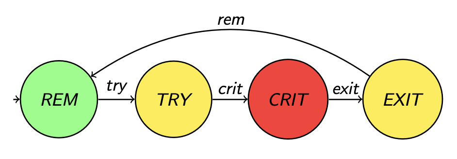

# Sincronización: Razonamiento y problemas clásicos

## El problema de los turnos

Tenemos una serie de procesos ejecutando en simultáneo \\( P_i, i \in
\[0, \dots, N-1\] \\). Cada proceso tiene que imprimir "Soy el proceso
\\( i \\)", y queremos que se haga en orden. (podría ser realizar
cualquier tarea en realidad, lo importante es la constraint de orden).

Podemos pensar en una solución como la siguiente:

```
// Semáforos. Tengo 1 por cada proceso (y uno extra)
semaphore sem[N+1];

// Inicialización
fn init() {
  for i in 0..N+1 {
    sem[i] = 0; // blockeado
  }

  for i in 0..N+1 {
    spawn P(i);
  }

  sem[0].signal()
}


// Proceso i
fn P(i) {
  // Esperar turno
  sem[i].wait();
  // Ejecutar
  print("Soy el proc {:i}");
  // Avisar al próximo
  sem[i+1].signal();
}
```

El programa es correcto? Cómo demuestro correctitud en un código concurrente? Tengo tripla de hoare, teorema del invariante, especificación y esas cosas?

## Razonando en paralelo/concurrente

Modelo: \\( \tau = \tau_1, \dots \\) donde los \\( \tau_i \\) son diferentes estados del programa.

En programas paralelos *correcto* ya no significa lo mismo, ahora la correctitud pasa por verificar que ciertas propiedades se cumplen sobre cualquier ejecución (o sea, para cualquer scheduling posible).

### Qué tipo de propiedades tengo?

Vamos a tener:

- **propiedades de safety**: o sea nada malo ocurre.
  - ej: ausencia de deadlock, exclusión mutua, no hay pérdida de mensajes, los relojes no se desvían a más de \\( \delta \\) unidades de tiempo.
- **propiedades de progreso/liveness**: en algún momento algo "bueno sucede". Suele dar esa idea de que si tengo cosas que quiero que se ejecuten siempre estoy en posición de llegar al punto en que se ejecutan.
  - ej: "si aprieto el botón, eventualmente se llama a su callback", vendría a ser como que eventualmente el sistema responde a los estímulos.

```admonish info title="Observaciones"
Las propiedades de safety de alguna forma son "opuestas" a las de livenes. En qué sentido? Bueno, las propiedades de safety son algo que tienen que valer para toda ejecución, eso significa que cuando no se cumple es porque hay una ejecución en donde llego a que esa cosa mala ocurre. Eso a su vez implica que tengo **una** ejecución **finita**, o contraejemplo. Entonces si quiero probar que vale, asumo que no, obtengo un "contraejemplo" e intento llegar a un absurdo. Y si quiero probar que no vale alcanza con buscar el contraejemplo.

Por otro lado las propiedades de safety ocurre al revez. Suponer que no vale significa que sin importar la ejecución siempre tengo un camino que no llega (o sea tengo potencialmente una cantidad infinita de ejecuciones "infinitas"). Acá es al revés, para trabajar con cosas finitas lo demuestro "directo"
```

Una propiedad muy común es la de **fairness**. Se basa en la idea de que los procesos reciban su turno (para ejecutar, para ingresar a una sección crítica, etc.) con infinita frecuencia. En criollo, no ocurre que un proceso siempre quede postergado *ad infinitum*. Hay 3 tipos de fairness:

- **incondicional**: el proceso se ejecuta regularmente si **siempre está habilitado**.
- **Fuerte**: el proceso se ejecuta regularmente si **está habilitado con infinita frecuencia** (puede tener períodos de inhabilitación).
- **Débil**: el proceso se ejecuta regularmente si **está continuamente habilitado a partir de cierto punto**

En general, suponemos que fairness está dado por default y usamos eso para probar otras propiedades (generalmente liveness: porque puedo asumir que va a recibir turnos y va a "poder avanzar")

### Modelo Formal

Para trabajar con estas propiedades se utilizan **lógicas temporales**. En particular nosotros no vemos demostraciones si no mas bien argumentaciones de que las propiedades se cumplen.

## Otro problema clásico: Rendezvous

- tengo procesos \\( P_i, i \in \[0, \dots, N - 1\] \\)
- la propiedad a demostrar es la propiedad <span style="color:red">BARRERA</span>:

\\[
  b(j) \text{ se ejecuta después de todos los } a(i)
\\]

- observación: no impongo ninguna restricción sobre el orden de los \\( a(i) \\) ni los \\( b(i) \\).

## Modelo Formal V2.0

Usamos un modelo propuesto en el libro de Nancy Lynch:



- Estado: \\( \sigma : \[ 0, \dots, N - 1 \] \rightarrow \lbrace \text{REM}, \text{TRY}, \text{CRIT}, \text{EXIT} \rbrace \\)
- Transición: \\( \sigma \rightarrow^{l} \sigma' , l \in \[ 0, \dots, N - 1 \] \rightarrow \lbrace \text{REM}, \text{TRY}, \text{CRIT}, \text{EXIT} \rbrace \\)
- Ejecución: \\( \tau = \tau_0 \rightarrow^l \tau_1 \dots \\)

### Algunas propiedades bajo el modelo formal

- <span style="color:red">WAIT-FREEDOM</span>
  - idea: "Todo proceso que intenta acceder a la sección crítica, en algún momento lo logra, cada vez que lo intenta"
  - fórmula: \\( \forall \tau, \forall k, \forall i, \tau_k(i) = \text{TRY} \implies \exists k' > k \land \tau_{k'}(i) = CRIT \\)
- <span style="color:red">FAIRNESS</span>
  - en castellano: "Para toda ejecución y proceso, si el proceso puede hacer una transición (la mismoa) **en una cantidad infinita de estados** de la ejecución, entonces existe un momento en el que hace la transición"
  - fórmula: \\( \forall \tau, \forall i, \| \lbrace \tau' : \tau \rightarrow \dots \tau' \rightarrow^{l_i} \tau'' \rbrace \| = \infty \implies \exists k, \tau_k \rightarrow^{l_i} \tau_{k+1} \\)
- <span style="color:red">EXCL</span>
  - idea: "Para toda ejecución y estado , no puede haber más de un proceso tal que ambos estén en estado CRIT"
  - fórmula:

  \\[
  \text{EXCL} \equiv \square \text{#CRIT} \leq 1
  \\]
- <span style="color:red">LOCK-FREEDOM</span>
  - idea: para toda ejecución y estado, si hay un proceso en estado TRY y ninguno en CRIT, entonces eventualmente algún proceso está en CRIT (capaz el que estaba en TRY le ganaron de mano, pero alguno entra)
  - fórmula: \\( \square ( \text{#TRY} \geq 1 \text{#CRIT} = 0 \implies \diamond \text{#CRIT} > 0 ) \\)
- <span style="color:red">STARVATION-FREEDOM</span>
  - predicados auxiliares:
    - IN: si un proceso está en try, eventualmente está en crit

    \\[
      \text{IN}(i) \equiv i \in \text{TRY} \implies \diamond i \in \text{CRIT}
    \\]

    - OUT: si un proceso está en la zona crítica, eventualmente sale de la zona crítica

    \\[
      \text{OUT}(i) \equiv i \in \text{CRIT} \implies \diamond i \in \text{REM}
    \\]
  - idea: Si todo proceso eventualmente sale de la zona crítica, entonces todo proceso eventualmente entra a la zona crítica
  - fórmula: \\( \forall i. \text{OUT}(i) \implies \forall i. \text{IN}(i) \\)

```admonish info title="Observación"
Podemos reescribir <span style="color:red">WAIT-FREEDOM</span> usando el predicado IN:

\\[
  \text{WAIT-FREEDOM} \equiv \forall i. \square \text{IN}(i)
\\]
```

- <span style="color:red">SCM</span> (sección crítica de a M procesos)
  - idea: puedo tener **hasta M procesos** en la sección crítica (esto por ejemplo aplica cuando tengo semáforos)
  - fórmula:

  \\[
  \begin{align}
    \forall \tau. \forall k. \\\\
    \text{1) #}& \lbrace i \| \tau_k(i) = CRIT \rbrace \leq M \\\\
    \text{2) #}& \forall i. \tau_k(i) = TRY \land \text{#}\lbrace j \| \tau_k(j) = CRIT \rbrace < M \\\\
    &\implies \exists k' > k. \tau_{k'}(i) = CRIT
  \end{align}
  \\]

## Problema Lectores/escritores

- esto lo vemos en bases de datos (cuando vemos logging, manejo de transacciones, y errores/aborts)
- tengo una variable compartida
- los escritores necesitan acceso exclusivo, los lectores pueden leer al mismo tiempo
- propiedad <span style="color:red">SWMR</span> (Single-Writer/Multiple-Readers)
  
  \\[
    \forall \tau \forall k. \exists i. writer(i) \land \tau_k(i) = \text{CRIT} \implies \forall j \neq i. \tau_k(j) \neq \text{CRIT} \\\\
    \forall \tau. \forall k. \exists i. reader(i) \land \tau_k(i) = \text{CRIT} \implies \\\\
      \forall j \neq i. \tau_k(j) = CRIT \implies reader(j)
  \\]

  - El primer predicado fuerza que si un proceso está escribiendo no hay otros procesos en la sección crítica
  - El segundo predicado dice que si hay un proceso leyendo, entonces cualquier otro proceso que también esté en la sección crítica tiene que estar leyendo (y por ende no escribiendo. (El anterior lo inmplica en realidad)

## Solución y análisis al problema

Uso 2 semáforos y un contador:

```
semaphore wr = 1;
// Nota: este semáforo lo uso como mutex para 
// obtener acceso exclusivo a `readers`
semaphore rd = 1;
int readers = 0;

fn writer(i) {
  // TRY
  wr.wait();
  // CRIT
  write();
  // EXIT
  wr.signal();
}

fn reader(i) {
  // TRY
  rd.wait();
  readers++;
  if readers == 1 { 
    wr.wait(); 
  }
  rd.signal();
  // CRIT
  read();

  // EXIT
  rd.wait();
  readers--;
  if readers == 0 {
    wr.signal();
  }
  rd.signal();
}
```

Es esta implementación correcta? A simple vista uno diría que sí, pero en realidad no. Los procesos escritores pueden llegar a quedarse bloqueados permanentemente si por ejemplo hay constantemente lectores entrando a la sección crítica. En ese caso nunca "libero" el lock del writer y por más de que puede estar infinitamente disponible nunca le llega su turno. O sea puede haber **inanición**.

## Problemas adicionales

- filósofos que cenan
  - N filósofos en una mesa redonda, con tenedores (compartidos) a sus lados
  - tengo que programar las funciones `tomar_tenedores(filo_i)` y `soltar_tenedores(filo_i)` satisfaciendo:
    - <span style="color:red">EXCL-FORK</span>: tenedores de uso exclusivo
    - <span style="color:red">WAIT-FREEDOM</span>: sin deadlock
    - <span style="color:red">STARVATION-FREEDOM</span>: no inanición
    - <span style="color:red">EAT</span>: Más de un filósofo puede comer a la vez (variante de SCM)
  - nota de color: hay un resultado general que dice que **NO existe** una solución en la que todos los filósofos hacen lo mismo
  - una solución es hacer que todos salvo uno agarren el de la izquierda primero y el restante agarra a la derecha primero.
    - demo para ver que no hay deadlock: agarrá el grafo de las condiciones de cauffman, cuáles son los potenciales ciclos. Cuándo ocurre que hay deadlock? Puede ocurrir con el código actual?

```admonish info title="Nota sobre EAT"
Uno podría preguntarse: "Por qué tengo que definir <span style="color:red">EAT</span>? Si no restrinjo nada claramente permito que varios filósofos puedan comer a la vez." Creo que la respuesta a eso es que tener definido <span style="color:red">EAT</span> nos da información extra y es útil sobre todo para evaluar si nuestro algoritmo es correcto, ya que puedo ver el código y encontrar algún contraejemplo de que eso no se cumple. Si no tengo el predicado nunca tengo contra qué comparar.
```

- El barbero
  - 1 único barbero
  - una sala de espera con N sillas + la sala del barbero (cap. 1 persona)
  - cuando no hay clientes el barbero duerme
  - cuando entra un cliente
    - no hay lugar? => se va
    - hay lugar? entra y despierta al peluquero si está dormido
  - potencial impl:
    - un semáforo para despertar al barbero (y para que se vuelva a dormir cuando no quedan clientes)
    - un semáforo para hacer pasar al cliente a la silla del barbero
    - un contador atómico para contar clientes y ver que no nos pasamos de la capacidad

<!-- TODO: hay un ejercicio de clase que es formalizar las propiedades a garantizar y demostrar que las satisface, estaría bueno agregar eso -->
