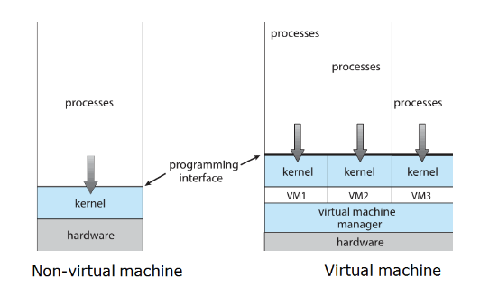
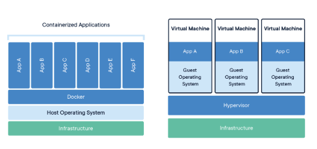
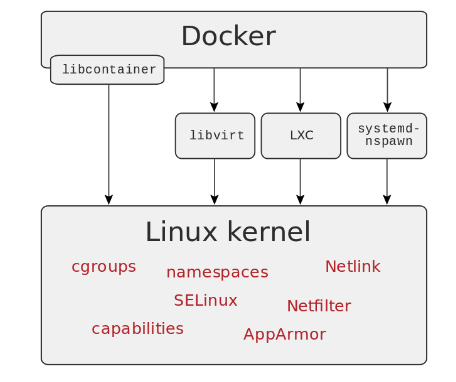

# Virtualización

Virtualización es hacer que recursos físicos se vean como varios recursos lógicos. Por ejemplo, una computadora haciendo el trabajo de varias.

Desde los 60 que se viene investigando el uso de máquinas virtuales por diversos motivos:

- Portabilidad (como la JVM)
- Simulación/testing
- Aislamiento (como vimos con chroot)
- Particionamiento de HW
- Agrupamiento de funciones
- Protección ante fallas de HW (migración de HW, por ejemplo ante fallas o aumento de tráfico)
- Migración de HW sin pérdida de servicio

## Cómo podemos virtualizar?

Hay 2 técnicas:

- Simulación
 - Leo código máquina y traduzco a la mía
 - El problema es que puede ser muy lento. Más aún, cómo simulo interrupciones, DMA, concurrencia, etc. No sería muy complejo, borderline imposible?
- Emulación
 - Acá el sistema emulado se ejecuta directamente sobre la CPU del anfitrión
 - Lo que se emulan son los componentes de HW
 - El grueso del código se corre mediante traducción binaria
 - Cómo logro separar privilegios? Toda VM corre en modo usuario.
 - qué pasa con la velocidad de acceso a dispositivos?

## Virtualización asistida por HW

En ese contexto surge la virtualización asistida por HW, sobre todo para evitar los problemas de (Nombres de Intel):

- Ring aliassing: programas escritos en modo kernel, pero como vimos se ejecutarían en modo usuario
- Address-space compression: cómo aislo la memoria de la VM respecto del resto de mi host device?
- Non-faulting access to privileged state: quiero simular instrucciones privilegiadas, y hay algunas que levantan un trap que puedo simular. Pero qué hago con las que no?
- Interrupt virtualization
  - hay que simular interrupciones en el host huésped
- Access to hidden state
  - No todo el estado del procesador es controlable por SW.
- Ring compression
  - Como tanto kernel virtualizado como sus programas corren todos en modo usuario, no hay protección entre espacio del kernel y espacio de usuario.
- Frequent access to privileged resources
  - se puede generar un cuello de botella en el controlador de máquinas virtuales cuando hay un acceso frecuente a un recurso que se quiere bloquear.

Para eso se empezó a agregar soporte de fábrica para la virtualización en el HW. Potr ejemplo, intel agregó las extensiones VT-x que tienen 2 modos:

- Modo VMX root: es igual que antes + extensiones (anfitrión)
- Modo VMX non-root: es el mismo set de instrucciones pero con instrucciones restringidas (huésped).

También agregaron la Virtual Machine Control Structure (en memoria), que soporta guardar campos de control, estado del huésped y del anfitrión. Cuando el huésped intenta realizar alguna acción restringida, el controlador de la máquina virtual recibe el control y emula, ignora y la termina a esa acción (en modo VMX root).

## Otros desafíos / problemas

- Qué pasa con las optimizaciones del kernel y el FS para acceder eficientemente a disco?
- hay un punto único de falla: al tener un único HW, si algo falla caen todas las VMs.

## Casos de uso

- correr sistemas viejos
- desarrollo / testing / debugging / reproducibilidad
- abaratamiento de costos
- escalado horizontal / vertical / autoscaling

## Containers

Algunas de las herramientas del kernel para implementar containers:

- Cgroups (Control Groups): limita lo que se puede usar (Memoria, CPU, I/O, etc.)
- Namespaces: Provee a los procesos una visión propia de los recursos del kernel.
- Netfilter: filtrado de paquetes
- Netlink: comunicación entre el kernel y procesos de usuario
- Capabilities: permite asignar selectivamente privilegios de admin
- SELinux y AppArmor: son módulos de seguridad que implementan MAC. SELinux es más versátil pero más complejo de configurar.

